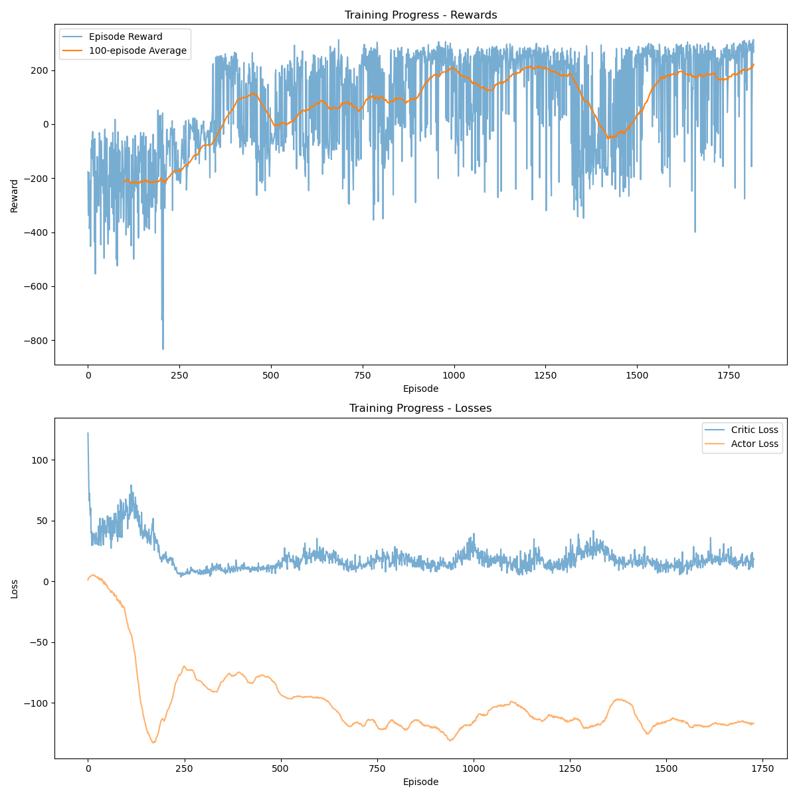

## Overview

By: Haoli Yin

### Training Statistics 

Environment solved in 465106 steps!
Training completed in 885.34 seconds
Final average reward (last 100 episodes): 226.59

You can see the training plot here: 



### Running

To run training, call: 
```bash 
python train_BipedalWalker_yinh4.py
```

To run testing, call: 
```bash 
python test_BipedalWalker_yinh4.py
```
